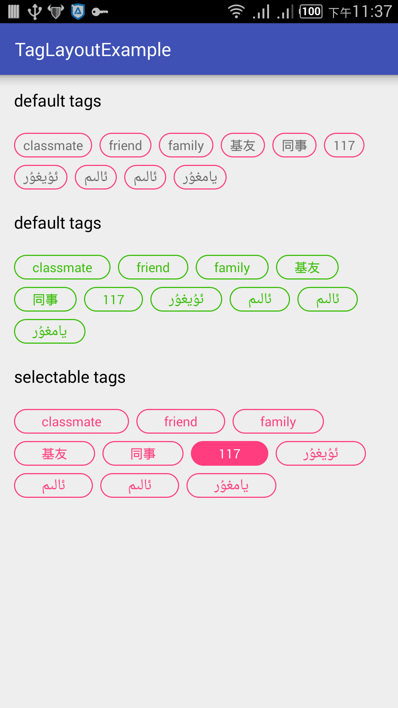

# TagLayout
taglayout

属性
------------
* horizontal_space 水平间距，tag与tag的距离
* vertical_space 垂直距离，上下tag的距离

方法
------------
* setCheckable 是否具有选中功能
* vertical_space 垂直距离，上下tag的距离
* setPadding(int lr, int tp)  lr 左右padding,tp 上下padding （都是以dp为单位）
* setOnItemClick(OnItemClick mOnItemClick)   tag点击事件
* setTags(List<? extends Object> list, BindProperty onBindProperty)  list中的对象必须覆写toString 方法
 public interface BindProperty {
        void OnBindProperty(TextView view);
    }
    接口你可以给tag赋予想要的样式 ，字体颜色等
   
    
```java
mTagGroupSelecable.setTags(getList(), new TagGroupLayout.BindProperty() {
            @Override
            public void OnBindProperty(TextView view) {
                view.setBackground(drawableUtil.getStateListDrawable());
                view.setTextColor(drawableUtil.getColorStateList());
            }
        });
```

screenshot
------------
#### git/svn, user, host, servers


Discussing
---
* email 2335515050@qq.com
* wechat 2335515050
